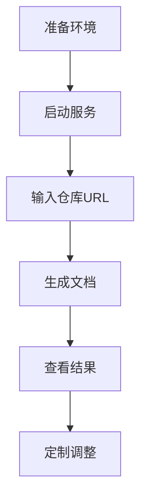

# 快速开始指南

## 环境准备

### 系统要求
- **Python**: 3.12 或更高版本
- **内存**: 至少 8GB RAM（运行 Ollama 模型）
- **磁盘空间**: 至少 2GB 可用空间
- **网络**: 可访问 GitHub 和下载模型

### 必需软件
1. **Python 3.12+**
2. **Git**
3. **Ollama**（本地模型服务）

## 安装步骤

### 1. 克隆项目仓库
```
git clone https://github.com/Lcysabcu/5-AutoDoc_Agent.git
cd 5-AutoDoc_Agent
```

### 2. 创建虚拟环境（推荐）
```
python -m venv venv
source venv/bin/activate  # Linux/Mac
# 或
venv\Scripts\activate     # Windows
```

### 3. 安装依赖包
```
pip install -r requirements.txt
```

### 4. 设置 Ollama 服务
```
# 启动 Ollama 服务（后台运行）
ollama serve

# 下载 deepseek-r1 模型
ollama pull deepseek-r1:7b
```

**验证模型安装**:
```
ollama list
```
应该显示 `deepseek-r1:7b` 模型。

## 基本使用方法

### 方法一：MCP 服务器模式（推荐）

#### 启动服务器
```
python server.py
```

服务器启动后，可以使用以下工具函数：

#### 生成文档
```
write_documentation("https://github.com/Lcysabcu/5-AutoDoc_Agent")
```

#### 查看生成的文档
```
# 列出所有文档
list_docs()

# 查看具体文档内容
view_content("docs/项目概述.mdx")
```

#### 获取帮助
```
get_help()
```

### 方法二：直接运行模式

#### 交互式运行
```
python main.py
```
然后输入目标 GitHub 仓库的 URL。

#### 命令行运行
```
python main.py --url "https://github.com/Lcysabcu/5-AutoDoc_Agent"
```

## 配置说明

### 模式选择
系统支持两种文档生成模式：

1. **项目介绍模式**（默认）
   - 配置文件: `*_program_zh.yaml`
   - 输出: 用户导向的项目介绍文档

2. **技术文档模式**
   - 配置文件: `*_code_zh.yaml` 
   - 输出: 开发者导向的技术参考文档

### 自定义配置
可以修改 `config/` 目录下的 YAML 文件来自定义：

- **智能体行为**: 修改 `*_agents_*.yaml`
- **任务描述**: 修改 `*_tasks_*.yaml`
- **输出要求**: 调整 expected_output 部分

## 使用示例

### 为示例项目生成文档
```
# 生成 Flask 项目的文档
write_documentation("https://github.com/pallets/flask")

# 生成 React 项目的文档  
write_documentation("https://github.com/facebook/react")
```

### 典型工作流程


## 输出文档结构

成功生成后，`docs/` 目录将包含：

```
docs/
├── 项目概述.mdx      # 项目简介和核心价值
├── 核心功能.mdx      # 详细功能说明
├── 快速开始.mdx      # 安装和使用指南
└── 架构设计.mdx      # 系统架构说明
```

## 故障排除

### 常见问题

#### 1. Ollama 连接失败
**症状**: `ConnectionError` 或模型无法加载
**解决**:
```
# 检查 Ollama 服务状态
ollama serve

# 验证模型是否下载
ollama list
```

#### 2. 仓库克隆失败
**症状**: `GitCommandError` 或克隆超时
**解决**:
- 检查网络连接
- 验证 GitHub URL 格式
- 确认仓库访问权限

#### 3. 内存不足
**症状**: 进程被杀死或运行缓慢
**解决**:
- 关闭其他占用内存的应用程序
- 考虑增加系统内存
- 使用更小的语言模型

#### 4. 文档生成中断
**症状**: 流程中途停止
**解决**:
```
# 清理工作目录
rm -rf workdir/
rm -rf docs/

# 重新运行生成流程
```

### 获取帮助

如果遇到其他问题：

1. 查看详细错误日志
2. 使用 `get_help()` 函数获取使用指南
3. 检查项目 Issue 页面寻找类似问题
4. 提交新的 Issue 包含错误信息和复现步骤

## 下一步

完成快速开始后，您可以：

- 🎯 **探索高级功能**: 了解自定义配置和扩展功能
- 🔧 **定制生成流程**: 根据需求调整文档生成策略  
- 📚 **查看示例输出**: 参考生成的文档质量标准
- 🤝 **参与贡献**: 帮助改进项目功能和文档

现在您已经准备好开始使用智能文档生成工具了！尝试为您的第一个项目生成文档吧。
