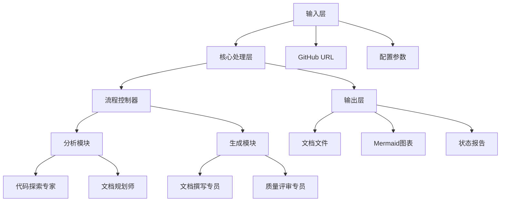
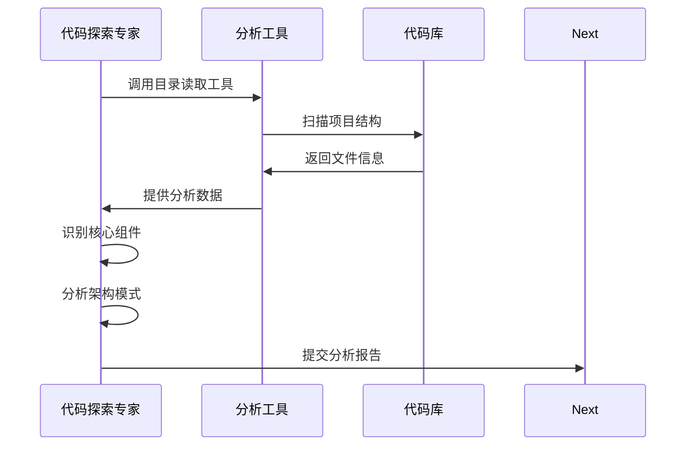
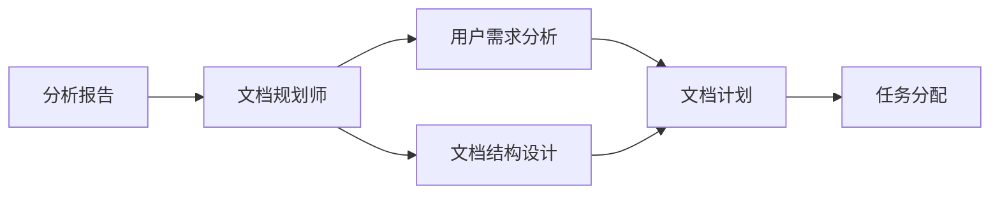
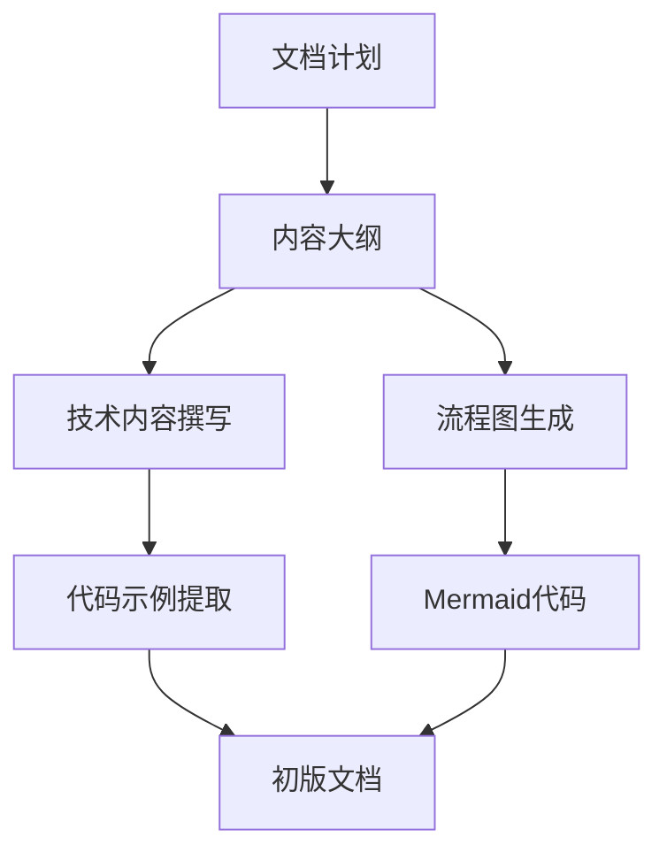
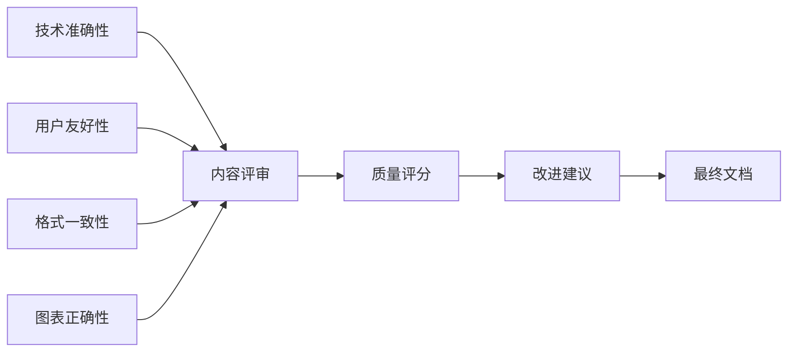
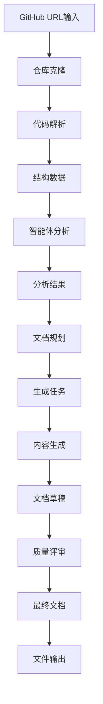
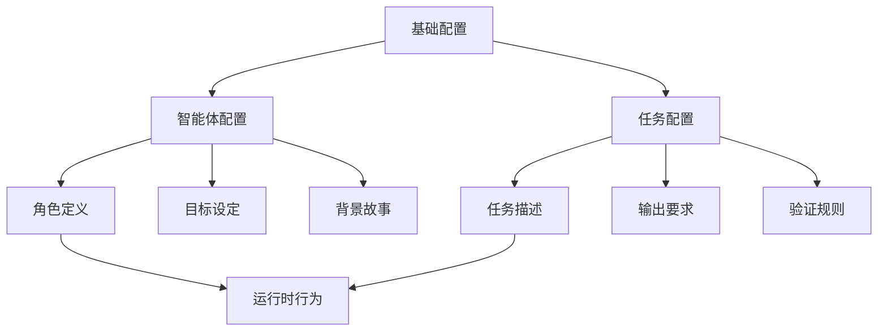
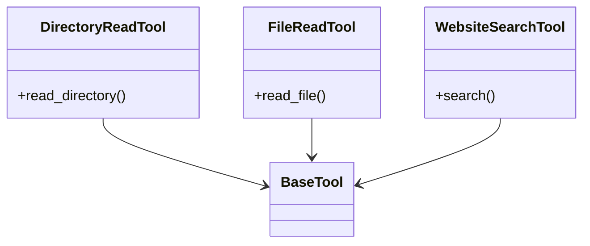
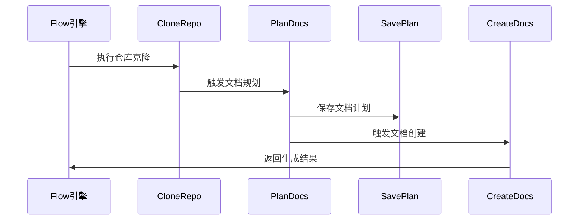
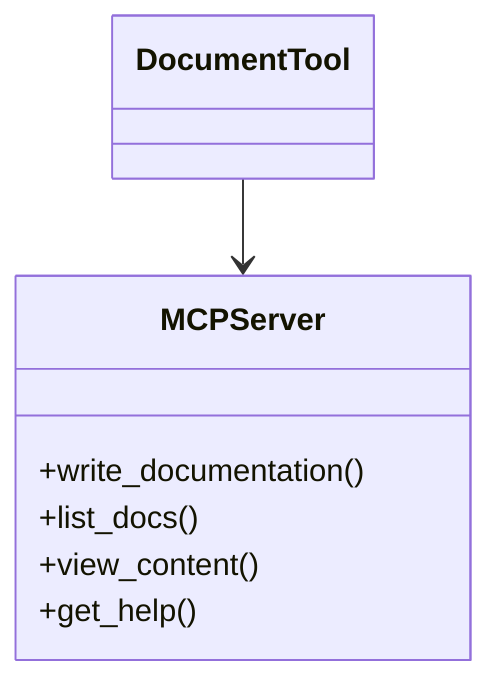

# 系统架构设计

## 总体架构概述

智能文档生成工具采用基于 CrewAI 的多智能体架构，通过模块化设计实现高效的文档自动化生成。系统核心在于四个专业智能体的协同工作，每个智能体承担特定职责，共同完成从代码分析到文档输出的完整流程。

## 系统组件架构

### 核心模块组成


## 智能体架构设计

### 分析阶段智能体

#### 代码探索专家
**职责**: 深度分析代码库结构和架构

**工作流程**:


**核心能力**:
- 项目结构解析和模块识别
- 代码依赖关系分析
- 架构设计模式识别
- 关键接口和抽象层发现

#### 文档规划师
**职责**: 基于分析结果制定文档策略

**输入输出关系**:


### 生成阶段智能体

#### 文档撰写专员
**职责**: 根据文档计划生成具体内容

**内容生成流程**:


**特色功能**:
- 自动生成 Mermaid 流程图
- 从代码库提取真实示例
- 用户友好的语言表达
- 技术准确的内容描述

#### 质量评审专员
**职责**: 确保文档质量和准确性

**评审维度**:


## 数据流架构

### 端到端数据流


### 状态管理
系统使用 Pydantic 模型进行状态管理：

**核心状态模型**:
```
class DocumentationState:
    project_url: str          # 项目URL
    repo_path: Path          # 本地仓库路径
    docs: List[str]          # 生成的文档列表
    analysis_result: Dict    # 分析结果
    plan: DocPlan           # 文档计划
```

## 配置管理系统

### 分层配置架构


### 配置热重载
- YAML 配置文件驱动智能体行为
- 运行时配置加载和验证
- 支持模式切换和参数调整

## 工具集成架构

### 工具系统设计
**核心工具集**:


### 工具调用机制
- 智能体按需调用专用工具
- 工具结果自动集成到工作流
- 错误处理和重试机制

## 流程控制架构

### Flow 引擎设计
基于 CrewAI Flow 的流程控制：

**核心流程步骤**:


### 错误处理和恢复
- 每一步的异常捕获和处理
- 中间状态保存和恢复
- 重试机制和超时控制

## 输出生成架构

### 文档格式化系统
**输出管道**:


### 质量保障管道
- 自动化的语法和格式检查
- 链接和引用验证
- 图表语法正确性验证
- 一致性检查和质量评分

## 扩展性设计

### 插件架构
**可扩展组件**:
- 自定义智能体类型
- 新的分析工具集成
- 输出格式支持扩展
- 工作流步骤定制

### API 设计
**MCP 服务器接口**:


## 性能优化设计

### 资源管理
- 智能体的并发控制
- 内存使用优化
- 模型调用批处理
- 缓存机制实现

### 可伸缩性
- 模块化的组件设计
- 配置驱动的行为调整
- 资源按需分配
- 分布式部署支持

这个架构设计确保了系统的高效性、可靠性和可扩展性，能够适应不同规模和复杂度的项目文档生成需求。