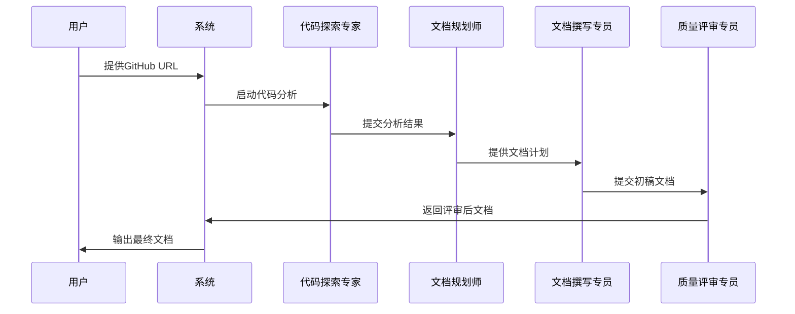

# 核心功能详解

## 双模式文档生成系统

### 项目介绍模式
**目标**: 从用户角度展示项目价值和使用方法

**功能特点**:
- 聚焦项目能解决什么问题
- 描述典型使用场景
- 突出项目特色和优势
- 提供清晰的使用指南

**输出内容**:
- 项目概述和核心价值
- 功能特性介绍
- 快速开始指南
- 使用场景示例

### 技术文档模式
**目标**: 为开发者提供详细的技术参考

**功能特点**:
- 分析代码架构和设计
- 提供 API 参考和代码示例
- 描述实现逻辑和工作流程
- 包含技术细节和配置说明

**输出内容**:
- 系统架构文档
- API 参考手册
- 开发指南
- 部署说明

## 智能分析引擎

### 代码库结构分析
代码探索专家 → 分析项目结构 → 识别核心组件

**分析维度**:
- 项目文件组织结构
- 核心代码模块识别
- 依赖关系和接口分析
- 架构模式识别

### 功能价值识别
**识别内容**:
- 项目要解决的核心问题
- 目标用户群体特征
- 主要功能模块
- 技术特色和优势

## 多智能体协作流程

### 规划阶段智能体


**代码探索专家**:
- 角色: 分析代码库结构并识别关键组件
- 能力: 深入理解代码逻辑，识别架构设计意图
- 输出: 技术分析报告

**文档规划师**:
- 角色: 基于分析结果创建文档策略
- 能力: 将技术概念转化为文档结构
- 输出: 详细的文档计划

### 生成阶段智能体


**文档撰写专员**:
- 角色: 撰写清晰、全面的项目文档
- 能力: 以易于理解的方式解释技术概念
- 输出: 初版文档内容

**质量评审专员**:
- 角色: 确保文档一致性、准确性与完整性
- 能力: 细节洞察，技术准确性验证
- 输出: 经过评审的最终文档

## 文档生成工作流

### 完整生成流程


### 质量保障机制
**多轮评审流程**:
1. **技术准确性评审**: 验证文档内容与代码实现一致性
2. **用户视角评审**: 确保文档对目标用户友好易懂
3. **格式一致性评审**: 统一文档风格和格式标准
4. **流程图验证**: 检查业务逻辑和技术架构图的准确性

## 输出管理系统

### 文档格式支持
- **Markdown/MDX**: 主要输出格式，支持丰富的内容元素
- **Mermaid 图表**: 自动生成流程图、架构图等可视化内容
- **代码示例**: 从实际代码库提取的验证过的代码片段

### 文件组织
```
docs/
├── 项目概述.mdx
├── 核心功能.mdx
├── 快速开始.mdx
└── 架构设计.mdx
```

## 扩展性和定制性

### 配置驱动
- YAML 配置文件定义智能体行为
- 可调整的任务描述和输出要求
- 支持自定义文档模板

### 模块化设计
- 独立的智能体模块
- 可插拔的工具系统
- 灵活的工作流组合

通过以上核心功能的协同工作，本项目能够为各种类型的 GitHub 项目生成专业、准确、用户友好的文档，显著提升项目的可理解性和易用性。