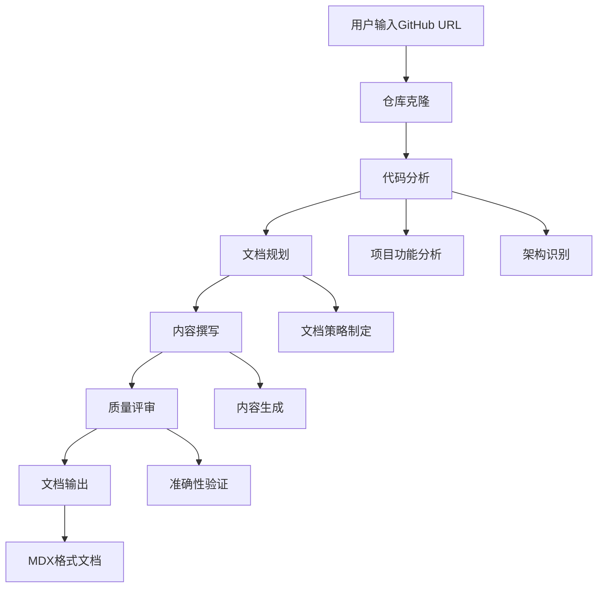

# 智能文档生成工具 - 项目概述

## 项目简介

智能文档生成工具是一个基于 CrewAI 多智能体框架的自动化文档生成系统，能够智能分析 GitHub 项目并生成高质量的中文技术文档和项目介绍文档。

## 核心价值

### 解决的主要问题
- **文档编写耗时**: 传统文档编写需要大量人工投入，本项目实现自动化生成
- **文档质量不一**: 通过多智能体协作确保文档准确性和一致性
- **双视角覆盖**: 同时满足用户视角的项目介绍和开发者视角的技术文档需求

### 目标用户
- **开源项目维护者**: 需要为项目提供完善文档的开发者
- **技术文档工程师**: 需要快速生成项目基础文档的专业人员
- **开发团队**: 需要统一文档标准和格式的团队项目

## 核心功能

### 双模式文档生成
```
项目介绍模式 → 用户视角，功能价值导向
技术文档模式 → 开发者视角，技术实现导向
```

### 智能工作流程
```
1. 代码库分析 → 2. 文档规划 → 3. 内容撰写 → 4. 质量评审 → 5. 输出文档
```

### 多智能体协作
- **分析阶段**: 代码探索专家 + 文档规划师
- **生成阶段**: 文档撰写专员 + 质量评审专员

## 系统架构



## 技术特色

### 🚀 自动化程度高
- 端到端的自动化文档生成流程
- 智能识别项目结构和核心功能
- 自动生成流程图和架构图

### 🎯 文档质量优秀
- 多轮评审确保内容准确性
- 统一的文档风格和格式
- 用户友好的语言表达

### 🔧 灵活可配置
- 支持两种文档生成模式
- 可定制的智能体行为
- 模块化的任务配置

## 项目优势

1. **效率提升**: 将文档编写时间从小时级缩短到分钟级
2. **质量保证**: 通过智能体协作确保文档专业性和准确性
3. **覆盖全面**: 同时满足技术文档和项目介绍需求
4. **易于使用**: 简单的命令行和 MCP 服务器两种使用方式

## 典型应用场景

- **开源项目上线**: 快速生成项目介绍和使用文档
- **项目文档维护**: 自动化更新项目文档
- **团队知识管理**: 统一团队项目的文档标准
- **技术分享准备**: 快速生成技术分享材料

本项目通过智能化的多智能体协作，为 GitHub 项目提供高效、高质量的文档生成服务，显著提升项目文档的完整性和专业性。